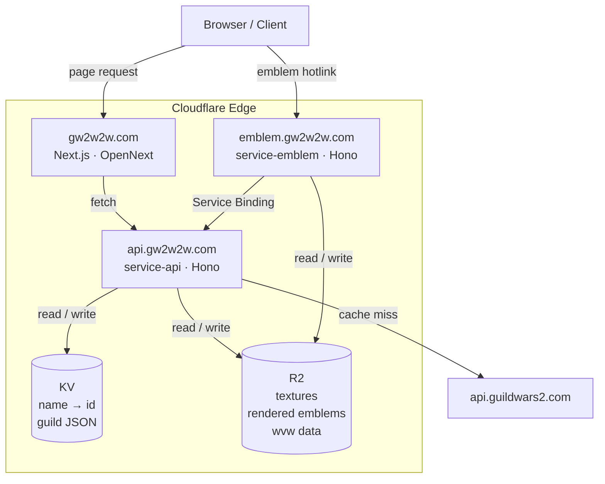

> **Note:** This README should be kept up to date as features change. If you add, remove, or significantly alter a feature, update the relevant sections here before merging.

# gw2w2w.com

An open-source suite of utilities for [Guild Wars 2](https://www.guildwars2.com/) players, built on the Cloudflare edge. The name is a play on the game's WvW mode — **World vs. World** (WvW) is GW2's large-scale, three-faction PvP mode where servers compete to capture objectives across a persistent map.

## Features

- **Guild Emblem Hotlinks** — Render any guild's emblem (the coat-of-arms-style icon each guild designs in-game) as a WebP image by guild name or ID. Drop a URL into Discord, a forum, or any website. Hosted at `emblem.gw2w2w.com/<guildId>`.
- **Emblem Designer** — WIP: Interactive client-side editor to build and preview emblems from scratch using official ArenaNet assets.
- **WvW Objective Status** — WIP: Real-time tracking of WvW map objectives (towers, keeps, castles) across all active matchups.
- **WvW Teams** — Directory of which guilds are registered to each WvW team.

## Architecture

This is a [Turborepo](https://turbo.build/) monorepo with three deployed Cloudflare Workers and a shared internal package library.



### Applications

| App                   | Domain              | Description                                                                                                        |
| --------------------- | ------------------- | ------------------------------------------------------------------------------------------------------------------ |
| `apps/gw2w2w`         | `gw2w2w.com`        | Next.js 15 frontend, deployed via [OpenNext](https://opennext.js.org/) on Cloudflare Workers (no Node.js required) |
| `apps/service-emblem` | `emblem.gw2w2w.com` | Hono Worker — renders guild emblems as WebP, caches in R2 (port `8787` locally)                                    |
| `apps/service-api`    | `api.gw2w2w.com`    | Hono Worker — GW2 API proxy with KV + R2 tiered caching (port `8788` locally)                                      |

### Packages

| Package                      | Description                                                                                                                                                                                                                      |
| ---------------------------- | -------------------------------------------------------------------------------------------------------------------------------------------------------------------------------------------------------------------------------- |
| `packages/emblem-renderer`   | Shared emblem rendering logic. `index.ts` — server-side (Photon WASM, Workers-only). `pixels.ts` — pure platform-independent compositing loop shared by both server and browser. |
| `packages/utils`             | Shared routing, validation, and string utilities                                                                                                                                                                                 |
| `packages/eslint-config`     | Shared ESLint configuration                                                                                                                                                                                                      |
| `packages/typescript-config` | Shared TypeScript configuration                                                                                                                                                                                                  |

### Rendering Engine

ArenaNet's API provides emblem layers as grayscale textures. Each layer is colorized by treating its texture channel as an opacity mask for a flat GW2 palette color, then alpha-composited together in layer order using a Porter-Duff "over" operation.

The rendering pipeline is split across three files in `packages/emblem-renderer`:

- **`pixels.ts`** — Pure, platform-independent compositing loop. Operates entirely on `Uint32Array` pixel buffers. Used by both server and browser. Accepts pre-decoded `DecodedLayer` objects and `ColorRGB` options. Supports rendering individual layers in isolation (e.g. bg-only or fg-only previews).
- **`index.ts`** (server-only) — Wraps `pixels.ts` with [Photon](https://github.com/silvia-odwyer/photon) WASM (via [`@cf-wasm/photon`](https://www.npmjs.com/package/@cf-wasm/photon)) for PNG decoding and flip transforms. Returns a `PhotonImage` ready for WebP encoding via `get_bytes_webp()`. Used exclusively by `service-emblem`.
- **`decodeLayer.ts`** (browser, in `apps/gw2w2w`) — Wraps `pixels.ts` with [`@silvia-odwyer/photon`](https://www.npmjs.com/package/@silvia-odwyer/photon) WASM for PNG decoding and flip transforms in the browser. The WASM module is lazy-loaded once when the user initiates the texture download and reused for all subsequent renders.

**Server path** (`service-emblem`): Photon decodes PNGs → `pixels.ts` composites → Photon encodes WebP → cached in R2.

**Browser path** (designer preview): textures fetched via `/api/texture` Next.js route (reads from the shared R2 cache) → `@silvia-odwyer/photon` WASM decodes PNGs and applies flip transforms → `pixels.ts` composites → `ImageData` painted to `<canvas>`. Colors re-composite instantly without re-fetching or re-decoding. The Photon WASM module (~1.8 MB) is loaded once in the browser when the user initiates the texture download.

### Caching Strategy

`service-api` uses a two-tier cache to minimize GW2 API calls:

1. **Cloudflare KV** — Fast, globally-replicated cache for API responses.
2. **Cloudflare R2** — Persistent object storage for raw textures and rendered emblem images, so each unique emblem is rendered only once.

### Emblem Rendering Workflow

End-to-end walkthrough of a request to `emblem.gw2w2w.com/arenanet`:

**1. `service-emblem` receives `GET /arenanet`**
The Hono router in `apps/service-emblem` matches `/:guildId`. `arenanet` is not a valid ArenaNet UUID, so it is treated as a guild name search.

**2. Name → Guild ID resolution (via `service-api` Service Binding)**
`service-emblem` calls `service-api` directly over a [Service Binding](https://developers.cloudflare.com/workers/runtime-apis/bindings/service-bindings/) (zero-latency Worker-to-Worker RPC, no HTTP round-trip):

- `GET /gw2/guild/search?name=arenanet`
- `service-api` checks KV for a cached `guild-name:arenanet` → guild ID mapping
- On miss, calls `api.guildwars2.com/v2/guild/search?name=arenanet`, caches the result in KV (24h TTL)
- Returns the resolved guild ID, e.g. `4BBB52AA-D768-4FC6-8EDE-C299F2822F0F`

**3. R2 check for a pre-rendered emblem**
`service-emblem` looks up `emblems:4BBB52AA-…` in R2.

- **Hit** → return the cached WebP bytes directly. Pipeline ends here on warm requests.
- **Miss** → continue to step 4.

**4. Guild detail fetch (via `service-api`)**
`GET /gw2/guild/4BBB52AA-…` → `service-api` checks R2 for `guild:4BBB52AA-…`:

- **Hit** → returns cached `Guild` JSON (background id, foreground id, color ids, flags)
- **Miss** → calls `api.guildwars2.com/v2/guild/4BBB52AA-…`, stores result in R2 (24h TTL), returns JSON

**5. Parallel asset fetch (via `service-api`)**
With the emblem spec in hand, `service-emblem` fires three parallel requests through the Service Binding:

- `GET /gw2/emblem/background/{id}` — fetches the emblem background layer definition (layer file URLs + indices), R2-cached
- `GET /gw2/emblem/foreground/{id}` — fetches the foreground layer definition (two layers: primary + secondary), R2-cached
- `GET /gw2/color/{id}` × N — fetches each unique color definition (RGB + material info), R2-cached with a year-long TTL (color data never changes)

Each of these checks R2 first; only on a miss does `service-api` call `api.guildwars2.com`.

**6. Texture fetch**
From the layer definitions, `service-emblem` resolves the actual grayscale texture URLs (ArenaNet render URLs) and fetches the image buffers — again R2-cached (static, year-long TTL). Background uses index `[0]`; foreground uses indices `[1, 2]` (primary and secondary fill layers).

**7. Render**
`renderEmblem()` from `packages/emblem-renderer` composites the layers in memory:

- Each grayscale texture channel is used as an opacity mask for its corresponding GW2 palette color
- Layers are alpha-composited in order (background → foreground primary → foreground secondary) using Porter-Duff "over" via a single-pass `Uint32Array` loop
- Flip flags (`FlipForegroundHorizontal`, etc.) are applied via Photon WASM transforms
- Result is encoded to WebP via `get_bytes_webp()`

**8. Cache and respond**
The rendered WebP bytes are written to R2 under `emblems:4BBB52AA-…` (24h TTL) and returned as `Content-Type: image/webp`. Future requests for the same guild skip steps 2–7 entirely.

## Key Design Decisions

**Three Workers instead of one**
`service-emblem` and `service-api` are split into separate Workers rather than merged. They have different scaling profiles (emblem requests are CPU-heavy due to WASM; API requests are I/O-bound), different cache TTL strategies, and different placement requirements (`service-api` is placement-hinted near `api.guildwars2.com` for low-latency upstream calls). Keeping them separate also means a WASM crash in `service-emblem` cannot take down the API.

**Service Bindings for Worker-to-Worker communication**
`service-emblem` calls `service-api` via a [Cloudflare Service Binding](https://developers.cloudflare.com/workers/runtime-apis/bindings/service-bindings/) rather than an HTTP fetch. This bypasses the network stack entirely — the call is dispatched in the same Cloudflare data center with no round-trip latency. Combined with [Hono RPC](https://hono.dev/docs/guides/rpc), the call site is fully type-safe end-to-end with no generated client code or OpenAPI spec required.

**R2 for blobs, KV for lookups**
KV is optimised for small, frequently-read key-value pairs (≤25MB, globally replicated). R2 is used for everything binary: grayscale textures, rendered WebP emblems, and large JSON collections (WvW match data, guild lists). This keeps KV fast and cheap while R2 handles bulk storage with no egress fees.

**TTL jitter on every cache write**
Every R2 and KV write adds ±10% random jitter to its expiry time. Without this, a burst of traffic that fills the cache simultaneously would expire simultaneously, causing a thundering herd of upstream API calls 24 hours later. Jitter spreads expirations across a window, smoothing the refresh load.

**Single-pass `Uint32Array` compositing**
Cloudflare Workers enforce a **50ms CPU time limit**. The WASM-based pixel compositing loop processes all layers in a single pass over a `Uint32Array` buffer — no intermediate `ImageData` allocations, no per-pixel branch on layer count. On a three-layer emblem at 256×256px this fits well within the budget even in a cold isolate.

**Placement hints near the upstream API**
`service-api` sets `placement.hostname = "api.guildwars2.com"` in its `wrangler.toml`. Cloudflare uses HTTP HEAD probes to locate the GW2 API and routes all Worker invocations to the nearest PoP. For the cold-cache path (500-guild fan-out), this cuts per-round-trip latency from ~200ms (cross-continent) to ~5–10ms, reducing total cold fill time by over 10×.

**Texture proxy route in the Next.js app**
`GET /api/texture?url=<encoded-gw2-render-url>` serves texture PNGs for the browser designer. It reads from the same `EMBLEM_ASSETS` R2 bucket bound to the Next.js worker, so the cache is shared with `service-emblem` — any texture pre-warmed by a guild emblem render is instantly available to the designer. The route validates that the `url` parameter is strictly a `render.guildwars2.com` path before fetching, preventing open-proxy abuse.

**One-time browser texture download**
The Emblem Designer requires textures to be downloaded to the browser's Cache API before it can render previews. The designer blocks on first visit until the user explicitly triggers the download (~650 textures, ~30 MB). Completion is recorded in `localStorage` so subsequent visits skip the gate. A "Re-download / verify" option is provided for cache invalidation. The Photon WASM module is also loaded in parallel during this download phase so it is ready by the time the user starts designing.

## Tech Stack

### Platform

- **[Cloudflare Workers](https://workers.cloudflare.com/)** — Serverless edge runtime. All three services run as Workers, executing at the data center closest to the user with no cold-start penalty and no servers to manage.
- **Cloudflare KV + R2** — KV provides fast globally-replicated key-value storage for API response caching; R2 provides S3-compatible object storage for raw textures and rendered emblems with no egress fees.

### Frontend

- **[Next.js 15](https://nextjs.org/) + [React 19](https://react.dev/)** — Frontend framework. Deployed to Cloudflare Workers via [@opennextjs/cloudflare](https://github.com/opennextjs/opennextjs-cloudflare), which adapts Next.js to run without Node.js.
- **[Tailwind CSS v4](https://tailwindcss.com/)** — Utility-first CSS framework.
- **[Headless UI](https://headlessui.com/) + [Heroicons](https://heroicons.com/)** — Accessible UI components and icons.

### Backend / Workers

- **[Hono](https://hono.dev/)** — HTTP framework for the two API Workers. Chosen for its tiny footprint (~14kb), zero dependencies, and first-class Cloudflare Workers support — critical when every byte counts in a Worker bundle.
- **WASM / [Photon](https://github.com/silvia-odwyer/photon)** — Image processing on both server and browser. On the server, [`@cf-wasm/photon`](https://www.npmjs.com/package/@cf-wasm/photon) handles PNG decoding, flip transforms, and WebP encoding in the `service-emblem` Worker. In the browser, [`@silvia-odwyer/photon`](https://www.npmjs.com/package/@silvia-odwyer/photon) (the upstream browser-targeted WASM build) handles PNG decoding and flip transforms for the Emblem Designer preview — loaded once on demand via dynamic `import()` and reused for all subsequent renders.

### Shared / Utilities

- **[Zod](https://zod.dev/)** — Runtime schema validation used across the stack: API request parameters in Workers and form/data validation in the frontend.
- **[lodash-es](https://lodash.com/)** — ES module build of Lodash for tree-shakeable utility functions.

### Tooling

- **[Turborepo](https://turbo.build/)** — Monorepo build system with intelligent task caching. Ensures only affected packages rebuild on change.
- **[pnpm](https://pnpm.io/)** — Package manager. Uses a content-addressable store and hard links to avoid duplicating packages on disk, making installs significantly faster and lighter than npm or yarn, especially in a monorepo.
- **[TypeScript](https://www.typescriptlang.org/)** — Used across all apps and packages with strict shared configs via `packages/typescript-config`.
- **[ESLint](https://eslint.org/) + [Prettier](https://prettier.io/)** — Linting and formatting enforced across the monorepo via shared configs in `packages/eslint-config`.

## Local Development

### Prerequisites

- [Node.js](https://nodejs.org/) 20+
- [pnpm](https://pnpm.io/) (via `corepack enable`)
- A [Cloudflare account](https://dash.cloudflare.com/sign-up) with `wrangler` authenticated (`pnpm wrangler:login`)
- A [GW2 API key](https://account.arena.net/applications) — add as `GW2_API_KEY=<your-key>` in `apps/service-api/.dev.vars`

### Steps

1. Clone the repo.
2. Enable pnpm: `corepack enable`
3. Install dependencies: `pnpm install`
4. Authenticate with Cloudflare: `pnpm wrangler:login`
5. Run all services in parallel: `pnpm dev`

The three services will be available at:

- `http://localhost:3000` — Next.js frontend (`apps/gw2w2w`)
- `http://localhost:8787` — service-emblem
- `http://localhost:8788` — service-api

### Other useful commands

```sh
pnpm check-types   # TypeScript type checking across all packages
pnpm lint          # ESLint across all packages
pnpm format        # Prettier formatting
```

## Deployment

### Before you deploy

The Workers require a Cloudflare KV namespace and R2 bucket to exist before first deploy. Create them via the Cloudflare dashboard or `wrangler` CLI, then update the `id` / `bucket_name` values in each app's `wrangler.toml`.

### Deploy commands

```sh
pnpm deploy          # deploy all three workers
pnpm deploy:api      # deploy service-api only
pnpm deploy:emblem   # deploy service-emblem only
pnpm deploy:app      # deploy gw2w2w only
```
